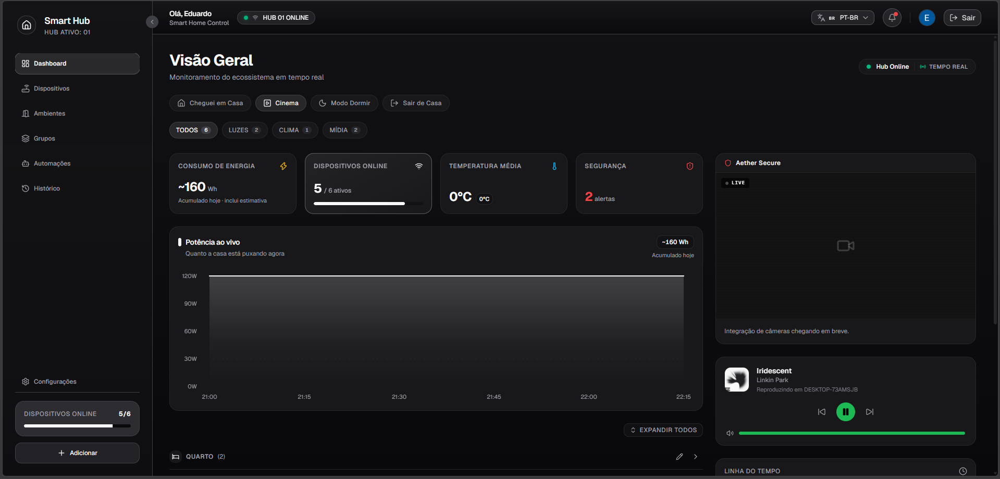
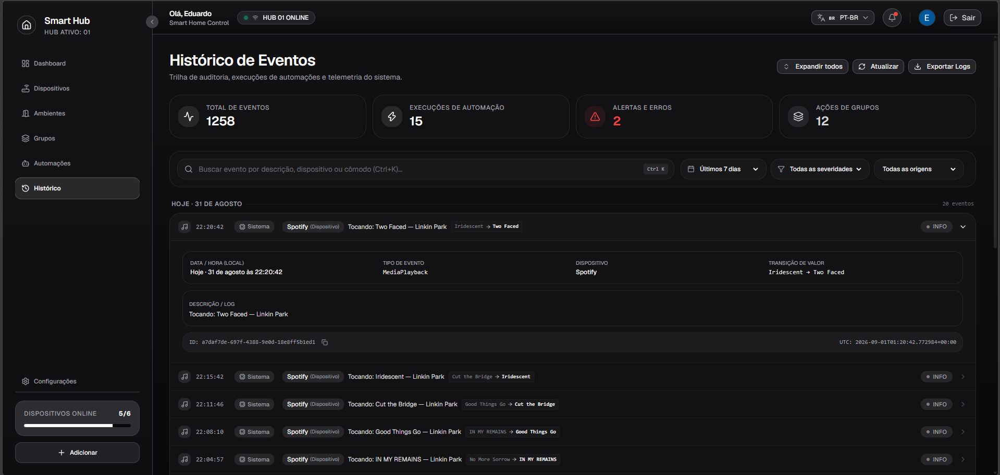
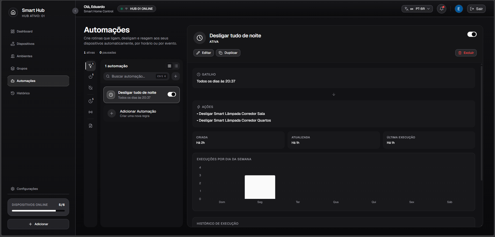
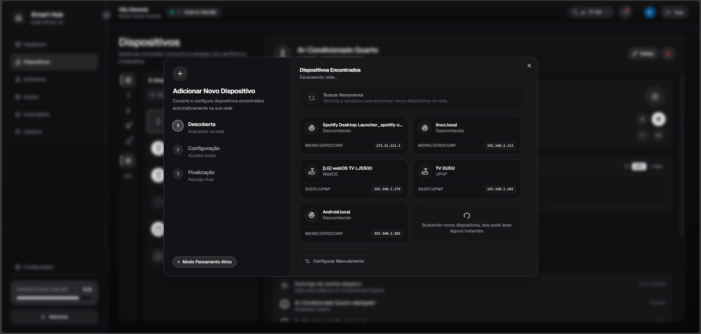

# 🏠 Smart Home Hub — IoT Local-First Platform

> Plataforma residencial inteligente local-first, com controle direto na rede local, telemetria em tempo real, automações e interface dark-mode.

[](https://dotnet.microsoft.com/)
[](https://react.dev/)
[](https://www.typescriptlang.org/)
[](https://tailwindcss.com/)
[](https://www.timescale.com/)
[](https://mosquitto.org/)

O sistema recebe dados de dispositivos comerciais (Sonoff, Tuya) via MQTT e protocolos locais, processa a telemetria com Clean Architecture + CQRS no back-end, e reflete cada mudança em tempo real no painel web via SignalR — sem depender de nuvem de terceiros para o controle básico da casa.

---

## ⚡ Destaques

- **Local-First & Baixa Latência** — comunicação direta na LAN via TCP/UDP, com driver nativo Tuya (v3.1 a v3.5, incluindo AES-GCM) e MQTT nativo (Sonoff/Tasmota/ESPHome).
- **Backend em CQRS** — `.NET 10`, `Mediator` (source generators), `Result Pattern` e validação com `FluentValidation`.
- **Telemetria em TimescaleDB** — hypertables append-only para métricas de energia e para a trilha de auditoria (`SystemEvents`), com agregações contínuas.
- **Automações reais** — motor de disparo com múltiplas ações por regra, wizard de criação, diagrama de fluxo e histórico de execução.
- **Tempo real de ponta a ponta** — SignalR sincroniza dispositivos, mídia (Spotify/TV), telemetria e execuções de automação sem precisar de F5.
- **Design System Dark-Mode** — escada semântica de superfícies (`index.css`), Feature-Sliced Design (FSD) estrito, i18n (PT/EN).

---

## 🏛️ Arquitetura

```text
┌──────────────────┐      WebSocket (SignalR) / REST     ┌───────────────────────┐
│  React 19 + FSD   │ ◄──────────────────────────────────► │  ASP.NET Core API     │
│  Tailwind CSS v4  │                                      │  CQRS / Mediator      │
└──────────────────┘                                      └──────────┬────────────┘
                                                                       │
                       ┌───────────────────────────────────────────────┼─────────────────────────┐
                       ▼                                               ▼                          ▼
           ┌─────────────────────────┐                    ┌──────────────────────┐   ┌──────────────────────┐
           │ PostgreSQL + TimescaleDB │                    │  Eclipse Mosquitto    │   │  Drivers Locais LAN   │
           │ (config + telemetria +  │                    │    (Broker MQTT)      │   │  (Tuya AES-GCM,       │
           │  SystemEvents)          │                    │                       │   │   Google Cast/ADB)    │
           └─────────────────────────┘                    └──────────────────────┘   └──────────────────────┘
```

---

## 🛠️ Stack

| Camada | Tecnologia |
|---|---|
| **Infraestrutura** | Docker Compose (bancos de dados e broker) |
| **Banco de Dados** | PostgreSQL + TimescaleDB (séries temporais e auditoria) |
| **Mensageria** | Eclipse Mosquitto (MQTT) |
| **Segurança** | Firebase Auth (usuários e tokens JWT) |
| **Back-end** | C# .NET 10 — ASP.NET Core Minimal APIs + Worker Services |
| **Observabilidade** | Serilog (logging estruturado) + Scalar (OpenAPI UI) |
| **Front-end** | React 19 + TypeScript, Vite, Tailwind CSS v4, Shadcn/Radix, Zustand, TanStack Query |
| **Tempo Real** | SignalR (WebSockets) |
| **Descoberta Automática** | mDNS, SSDP/UPnP, MQTT Discovery e Tuya UDP |
| **Integrações** | Spotify Web API (playback remoto) e Android TV/Google Cast via ADB de rede |

📖 Documentação aprofundada de cada camada:
- [**⚙️ Back-end**](./backend/README.md) — Clean Architecture, CQRS, EF Core, drivers de protocolo
- [**🎨 Front-end**](./frontend/README.md) — Feature-Sliced Design, Design System, roteamento e estado

---

## 🖼️ Capturas de Tela

| Dashboard | Histórico de Eventos |
|---|---|
|  |  |

| Automações | Descoberta de Dispositivos |
|---|---|
|  |  |

---

## 🚀 Como Rodar (Ambiente Local)

**Pré-requisitos:** [Docker Desktop](https://www.docker.com/products/docker-desktop/), [.NET 10 SDK](https://dotnet.microsoft.com/download), Node.js 22+

**1. Clone o repositório**
```bash
git clone https://github.com/seu-usuario/smart-home-hub.git
cd smart-home-hub
```

**2. Configure as variáveis de ambiente**
```bash
cp backend/.env.example backend/.env
cp frontend/.env.example frontend/.env.local
```
Preencha as credenciais do Postgres, Firebase e Spotify em `backend/.env`, e as chaves públicas do Firebase Web em `frontend/.env.local` (veja os comentários de cada arquivo para onde obter cada valor).

**3. Suba a infraestrutura (Postgres/TimescaleDB + Mosquitto)**
```bash
docker-compose up -d
```

**4. Inicie o back-end**
```bash
dotnet run --project backend/src/SmartHomeHub.Api
```
API em `http://localhost:5252` — documentação OpenAPI em `http://localhost:5252/scalar/v1`.

**5. Inicie o front-end**
```bash
cd frontend
npm install
npm run dev
```
Web app disponível em `http://localhost:5173`.

> 💡 Sem hardware físico à mão? O **Dev Tools Hub** (`/dev-tools`, só em ambiente de desenvolvimento) simula uma casa inteira — dispositivos, telemetria e conectividade — sem precisar de nada real. Veja a seção Fase 4.8 no roadmap.

---

## 🧪 Testes & Qualidade

```bash
# Back-end (unitários + integração via Testcontainers)
dotnet test

# Front-end (Vitest + Playwright E2E)
npm run test:run
npm run test:e2e
```

---

## 🗺️ Roadmap de Desenvolvimento

### ✅ Fase 1: Fundação da Infraestrutura
- [x] `docker-compose.yml` com volumes persistentes e `.env`
- [x] PostgreSQL com extensão TimescaleDB
- [x] Eclipse Mosquitto (Broker MQTT)
- [x] Comunicação interna na rede do Docker

### ✅ Fase 2: Motor do Back-end, Segurança e Observabilidade
- [x] Projeto ASP.NET Core Web API
- [x] EF Core mapeando `User`, `Room`, `Device`, `DeviceGroup`
- [x] Validação de token JWT do Firebase no middleware
- [x] Result Pattern, FluentValidation e GlobalExceptionHandler
- [x] CRUD de Ambientes, Dispositivos e Grupos com CQRS (Mediator) e isolamento multi-tenant
- [x] Serilog com escrita estruturada
- [x] Scalar API Documentation

### ✅ Fase 3: Comunicação IoT e Base de Testes
- [x] Background Service conectado ao Mosquitto
- [x] Topologia MQTT por identidade (`home/telemetry/{deviceId}`)
- [x] Persistência de telemetria append-only no TimescaleDB
- [x] Troféu de Testes automatizado (Testcontainers)
- [x] Motor genérico de paginação de queries

### ⏳ Fase 4: Painel de Controle — React + TypeScript *(fase atual)*

#### Fase 4.1–4.3: Base, Auth, Dispositivos e Ambientes (Concluídas)
- [x] Vite + TypeScript + Tailwind CSS, React Router, TanStack Query, Zustand
- [x] Design System com Shadcn UI / Radix
- [x] Autenticação Firebase e proteção de rotas
- [x] CRUD de Dispositivos e Ambientes, com toggle otimista e mapeamento de atuadores

#### Fase 4.4: Grupos de Dispositivos (Concluída)
- [x] Feature `device-groups`: listagem paginada, criação/edição com seleção múltipla
- [x] Ação em massa (ligar/desligar todos os dispositivos do grupo com um clique)

#### Fase 4.5: Telemetria, Métricas e Histórico de Eventos (Concluída)
- [x] `/dashboard/overview` com gráficos (Recharts) e SignalR para atualização sem F5
- [x] Modal de detalhes do dispositivo com histórico de consumo/temperatura
- [x] Potência instantânea (kW/W) separada de energia acumulada (kWh/Wh), com auto-escala
- [x] Consumo de energia por Ambiente
- [x] Temperatura média do dia com tendência vs. dia anterior
- [x] **Página dedicada de Histórico de Eventos** (`/history`), evoluída além do widget inicial de activity log:
  - Filtros combinados (período, severidade, origem, busca textual) com paginação
  - KPIs agregados (total, automações, alertas, ações de grupo) via query dedicada de estatísticas — não derivados da página atual
  - Ícones diferenciados por tipo de evento (`EventType`), além do badge de origem
  - Atualização em tempo real: eventos novos chegam via SignalR e aparecem como pill de "novos eventos" no topo da timeline

#### Fase 4.6: Testes, Qualidade & i18n (Concluída)
- [x] i18n (`react-i18next`) para Português e Inglês
- [x] Vitest + React Testing Library
- [x] Playwright E2E

#### Fase 4.7: Descoberta Automática & Integrações de Terceiros
- [x] Motor de descoberta (`IDeviceDiscoveryManager`): mDNS, SSDP/UPnP, MQTT Discovery, Tuya UDP
- [x] Fluxo de UI de descoberta em 3 passos (escanear → encontrar → configurar)
- [x] Integração com Spotify Web API (tocando agora, skip, volume, play/pause)
- [x] Controle de Android TV/Google Cast via ADB de rede
- [x] `DeviceStatePollingWorker` sincronizando estado real de TV/Spotify
- [x] `DeviceHealthCheckWorker` detectando dispositivos offline

#### Fase 4.8: Dev Tools Hub *(fora do roadmap original — só ambiente de desenvolvimento)*
- [x] Seed/clear de casa mock, disparo manual de telemetria/conectividade
- [x] `MockTelemetryWorker` gerando telemetria plausível a cada 5s
- [x] Tela `/dev-tools` reaproveitando a pipeline real de persistência e SignalR

### ⏳ Fase 5: Automações
- [x] Motor de disparo de automações (Mediator), com múltiplas ações por regra
- [x] Wizard de criação em múltiplos passos (gatilho → ações → revisão)
- [x] Diagrama de fluxo da automação (visualização read-only) na tela de detalhe
- [x] Histórico de execução por automação e gráfico de execuções por dia da semana
- [x] Contagem correta de execuções mesmo com múltiplas ações por disparo (deduplicação por `TraceId`)
- [ ] Editor visual **drag-and-drop** para montar regras (hoje é wizard passo-a-passo, não um canvas livre)
- [x] Condições compostas (E/OU) entre múltiplos gatilhos na mesma regra

---

## 🔮 Visão de Futuro (v2.0 e Escala)

- **☁️ Cloud Proxy** — acesso remoto seguro sem Port Forwarding
- **🔬 Microsserviços** — extrair o Telemetry Worker de alta volumetria (Go/Rust)
- **📊 Observabilidade Centralizada** — Prometheus + Grafana sobre as agregações do TimescaleDB
- **🤖 Automações Preditivas** — modelos locais de ML sobre hábitos históricos de consumo
- **🎙️ Assistentes de Voz** — Custom Skills para Alexa e Google Assistant via Cloud Proxy