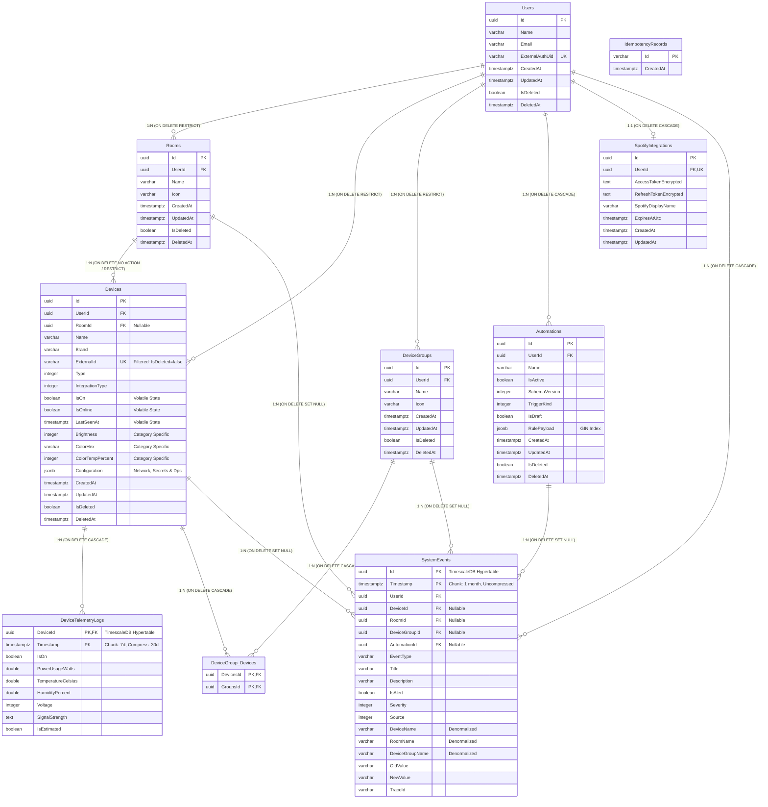

# 🏛️ Relatório Técnico: Auditoria Profunda do Modelo de Dados, EF Core & TimescaleDB

**Papel:** Principal Database Architect & DBA Especialista em PostgreSQL, TimescaleDB e EF Core  
**Sistema:** Smart Home Hub IoT (Backend .NET 10 / TimescaleDB / PostgreSQL 16+)  
**Data da Auditoria:** 03/09/2026  
**Status:** Análise técnica e plano de mitigação para revisão prévia  

---

## 1. Diagrama Lógico de Relações (Mermaid ERD)

O diagrama abaixo reflete a estrutura física e lógica mapeada no EF Core (`AppDbContextModelSnapshot`), detalhando chaves primárias, chaves estrangeiras, cardinalidades e as regras de integridade configuradas no schema físico.



---

## 2. Diagnóstico das "God Tables" (`Devices` e `SystemEvents`)

### A. Tabela `Devices`: O Anti-Pattern da Tabela Plana Monolítica

A entidade `Device` acumula atualmente cinco domínios heterogêneos na mesma linha física:

#### 1. Mapeamento de Responsabilidades

| Colunas / Propriedades | Tipo | Domínio de Responsabilidade | Frequência de Acesso | Diagnóstico de Coesão |
|---|---|---|---|---|
| `Id`, `ExternalId`, `Brand`, `Name`, `Type`, `IntegrationType` | Escalares | **Identidade & Hardware** | Alta leitura / Rara escrita | **Coeso**. Metadados cadastrais fundamentais do hardware. |
| `UserId`, `RoomId` | UUIDs (FKs) | **Topologia Espacial** | Alta leitura / Rara escrita | **Coeso**. Localização geográfica/lógica do equipamento. |
| `Configuration` (JSONB) | JSONB | **Credenciais & Protocolo** | Média leitura / Rara escrita | **Risco de Segurança**: Mistura dados de rede (`IpAddress`, `MacAddress`) com segredos criptográficos simétricos (`LocalKey` Tuya de 16 bytes) e tópicos MQTT. |
| `IsOn`, `IsOnline`, `LastSeenAt` | `bool`, `timestamptz` | **Estado Operacional Volátil** | Altíssima leitura / **Altíssima escrita** | **Crítico (Anti-pattern MVCC)**: Atualizado a cada pacote MQTT ou ciclo de polling (intervalos de poucos segundos). |
| `Brightness`, `ColorHex`, `ColorTempPercent` | `int?`, `varchar?` | **Atributos Específicos de Categoria (Lâmpadas)** | Média leitura / Média escrita | **Crítico (Sparse Columns)**: Anti-pattern de tabela plana sem polimorfismo limpo. Nulo para 80% dos dispositivos (switches, tomadas, sensores, TVs). |
| `CreatedAt`, `UpdatedAt`, `IsDeleted`, `DeletedAt` | Escalares | **Auditoria & Ciclo de Vida** | Alta leitura / Baixa escrita | **Padrão de Governança**. |

#### 2. Impacto no Motor Relacional PostgreSQL (MVCC & Dead Tuples)
Na ingestão de telemetria (`ProcessTelemetryCommandHandler`), a cada mensagem de sensor ou mudança de status:
* O sistema atualiza `device.IsOn`, `device.IsOnline` e `device.LastSeenAt`.
* Isso dispara um `UPDATE` em `Devices`. Como a tabela possui colunas largas (incluindo o JSONB `Configuration`), quando a página de dados enche, o PostgreSQL falha em realizar HOT (*Heap-Only Tuples*) updates.
* Resultado: geração contínua de tuplas mortas (*dead tuples*), bloat na tabela e nos 3 índices de `Devices`, e pressão desnecessária no processo de `autovacuum`.

---

### B. Tabela `SystemEvents`: Auditoria vs Telemetria

#### 1. Confirmação de Separação de Design
Foi auditado o fluxo de instanciação de `SystemEvent` em todo o backend:
* `ProcessTelemetryCommandHandler`: grava evento **apenas** quando há transição de estado (`wasOn != device.IsOn || !wasOnline`). Não grava leituras contínuas de sensores.
* `DeviceHealthCheckWorker`: grava apenas transições de conectividade (`DeviceOnline` / `DeviceOffline`).
* `AutomationActionDispatcher`: grava o resultado de execução de regras com `TraceId`.
* `DeviceStatePollingWorker`: grava alterações discretas de reprodução de mídia.
* `SetDeviceStateCommandHandler`: grava comandos explícitos disparados por usuários.

> **Diagnóstico:** A separação de design está estritamente cumprida. Leituras analógicas contínuas (Watts, Temperatura, Umidade, Tensão) fluem unicamente para `DeviceTelemetryLogs`. `SystemEvents` comporta apenas eventos discretos e transições operacionais.

#### 2. Riscos Operacionais em `SystemEvents`
* **Ausência de Compressão no TimescaleDB:** A tabela foi convertida em hypertable com chunks mensais, mas **não possui compressão nativa configurada**. O acúmulo de colunas de texto livres (`Title`, `Description`, `OldValue`, `NewValue`, `DeviceName`, `RoomName`, `DeviceGroupName`, `TraceId`) acarretará consumo desproporcional de disco.
* **Índice B-Tree Bloat:** Cada chunk mensal sustenta **11 índices simultâneos** mantidos a cada `INSERT`.
* **Varreduras Sequenciais (`LIKE '%...%'`):** No endpoint de histórico (`GetEventHistoryQuery`), a busca textual aplica `LOWER(...) LIKE '%search%'` em 5 colunas, forçando Full Hypertable Scans em múltiplos chunks.

---

### C. Plano de Refatoração e Decomposição de `Devices`

Propõe-se a divisão física e lógica entre metadados estáticos e estado operacional volátil:

```
┌─────────────────────────────────────────────────────────────────────────┐
│                     ARQUITETURA MODULAR (DEVICES)                       │
├───────────────────────────────────┬─────────────────────────────────────┤
│      TABELA: Devices (Estática)   │    TABELA: DeviceLiveStates (1:1)   │
├───────────────────────────────────┼─────────────────────────────────────┤
│ • Id (UUID, PK)                   │ • DeviceId (UUID, PK, FK -> Devices)│
│ • UserId (UUID, FK -> Users)      │ • IsOn (BOOLEAN)                    │
│ • RoomId (UUID?, FK -> Rooms)     │ • IsOnline (BOOLEAN)                │
│ • Name, Brand, ExternalId         │ • LastSeenAt (TIMESTAMPTZ)          │
│ • Type, IntegrationType           │ • Attributes (JSONB)                │
│ • Configuration (JSONB)           │   └─ { brightness, colorHex, ... }  │
│ • CreatedAt, IsDeleted...         │ • UpdatedAt (TIMESTAMPTZ)           │
└───────────────────────────────────┴─────────────────────────────────────┘
```

1. **Benefícios Imediatos:**
   * Ingestão de telemetria e polling de saúde atualizam exclusivamente `DeviceLiveStates` (tabela de 1 linha por dispositivo que reside 100% no *buffer pool* da RAM).
   * Eliminação completa de *dead tuples* e *bloat* na tabela principal `Devices`.
   * Flexibilidade total para novas categorias (termostatos, cortinas, fechaduras) via campo `Attributes` JSONB sem novas colunas nulas no banco relacional.
2. **Implementação Transparente no EF Core:**
   * Mapeamento 1:1 via Table Splitting ou navegação dedicada `device.LiveState`.

---

## 3. Matriz de Risco de Cascades (`DeleteBehavior`)

### Critério de Auditoria
1. **CASCADE Correto:** Aplicável exclusivamente onde o registro dependente não possui razão de existir sem o pai (ex: tabelas de junção associativa pura ou credenciais de sessão).
2. **RESTRICT Mandatório:** Aplicável onde uma exclusão física acidental via SQL direto provocaria perda catastrófica ou irreversível de ativos de dados essenciais (ex: histórico de ML ou trilhas de auditoria/segurança).

### Matriz Completa de Foreign Keys

| Tabela Origem (Filho) | FK Column | Tabela Destino (Pai) | Comportamento Físico Atual | Classificação Arquitetural | Análise de Risco & Justificativa Técnica |
|---|---|---|---|---|---|
| `Rooms` | `UserId` | `Users` | `ON DELETE RESTRICT` | **Correto (RESTRICT)** | Impede que a remoção acidental de um usuário via SQL direto apague todos os cômodos da residência. |
| `Devices` | `UserId` | `Users` | `ON DELETE RESTRICT` | **Correto (RESTRICT)** | Dispositivos físicos cadastrados são protegidos contra remoção catastrófica por SQL manual. |
| `Devices` | `RoomId` | `Rooms` | `ON DELETE NO ACTION` *(implícito)* | **Correto (RESTRICT)** | Protegido após a migration `RemoveCascadeFromDevice`. Deletar um cômodo via SQL direto é bloqueado caso haja dispositivos associados. |
| `DeviceGroups` | `UserId` | `Users` | `ON DELETE RESTRICT` | **Correto (RESTRICT)** | Protegido após a migration `RestrictDeviceGroupUserCascade`. |
| `DeviceGroup_Devices` | `DevicesId` | `Devices` | `ON DELETE CASCADE` | **Correto (CASCADE)** | Tabela de junção associativa N:N. Sem o dispositivo, a linha de vínculo não possui significado semântico. |
| `DeviceGroup_Devices` | `GroupsId` | `DeviceGroups` | `ON DELETE CASCADE` | **Correto (CASCADE)** | Tabela de junção associativa N:N. Sem o grupo, o vínculo é órfão. |
| `SpotifyIntegrations` | `UserId` | `Users` | `ON DELETE CASCADE` | **Correto (CASCADE)** | Relação 1:1 de credenciais de serviço externo. Se o usuário deixa de existir fisicamente, seus tokens OAuth devem ser expurgados. |
| `Automations` | `UserId` | `Users` | **`ON DELETE CASCADE`** | **Deveria ser RESTRICT** | **Risco Elevado**: Automações acumulam regras lógicas complexas e personalizadas no JSONB. Uma remoção direta de usuário apaga em cascata todas as automações sem aviso. Deve alinhar-se ao `RESTRICT` de `Rooms` e `Devices`. |
| `DeviceTelemetryLogs` | `DeviceId` | `Devices` | **`ON DELETE CASCADE`** | **Deveria ser RESTRICT** | **RISCO CATASTRÓFICO PARA O DATASET DE ML**: O projeto mantém telemetria histórica bruta deliberadamente sem retenção para treino de IA. Com `CASCADE`, um comando `DELETE FROM "Devices"` casual elimina instantaneamente anos de dados temporais insubstituíveis. `RESTRICT` força o operador a arquivar a telemetria antes de remover o dispositivo fisicamente. |
| `SystemEvents` | `UserId` | `Users` | **`ON DELETE CASCADE`** | **Deveria ser RESTRICT** | **Risco de Governança e Auditoria**: Trilha de eventos, auditoria e segurança da casa não deve sofrer expurgo automático em cascata caso uma conta de usuário seja excluída fisicamente via banco de dados. |
| `SystemEvents` | `DeviceId` | `Devices` | `ON DELETE SET NULL` | **Correto (SET NULL)** | Eventos de auditoria persistem mesmo se o hardware for excluído; o evento preserva o snapshot `DeviceName`. |
| `SystemEvents` | `RoomId` | `Rooms` | `ON DELETE SET NULL` | **Correto (SET NULL)** | Preserva o log com o snapshot `RoomName`. |
| `SystemEvents` | `DeviceGroupId` | `DeviceGroups` | `ON DELETE SET NULL` | **Correto (SET NULL)** | Preserva o log com o snapshot `DeviceGroupName`. |
| `SystemEvents` | `AutomationId` | `Automations` | `ON DELETE SET NULL` | **Correto (SET NULL)** | Preserva a trilha de execuções históricas mesmo após a exclusão física da regra. |

---

## 4. Revisão de Índices e Otimizações TimescaleDB

### A. Hipertabelas e Política de Compressão

1. **`DeviceTelemetryLogs`:**
   * **Status:** Chunk interval de 7 dias com compressão nativa ativa após 30 dias (`segmentby: DeviceId`, `orderby: Timestamp DESC`). Sem retention policy (respeitado).
   * **Avaliação:** Configuração padrão-ouro para séries temporais IoT.
2. **`SystemEvents`:**
   * **Status:** Chunk interval de 1 mês. Sem política de compressão.
   * **Ação Recomendada:** Habilitar compressão nativa após 60 dias (mantendo dados históricos preservados indefinidamente):
     ```sql
     ALTER TABLE "SystemEvents" SET (
         timescaledb.compress,
         timescaledb.compress_segmentby = '"UserId", "EventType"',
         timescaledb.compress_orderby = '"Timestamp" DESC'
     );
     SELECT add_compression_policy('"SystemEvents"', INTERVAL '60 days');
     ```

---

### B. Continuous Aggregate `device_telemetry_daily` & Gargalos em Queries

A continuous aggregate `device_telemetry_daily` está corretamente configurada com refresh policy diária. Porém, a auditoria identificou gargalos severos de consumo na camada de aplicação:

1. **Omissão de Métricas:** A view só agrega Watts e Temperatura. `HumidityPercent` e `Voltage` não constam na agregação diária.
2. **Subutilização em Consultas de 7 Dias:**
   * `GetRoomEnergyQuery` e `GetDeviceEnergyQuery` **ignoram a view agregada** quando executadas para a janela `7d`. Elas escaneiam milhares de linhas brutas de `DeviceTelemetryLogs` e calculam médias de potência em memória no C#. Conforme os dados envelhecem, isso força a descompressão de chunks do TimescaleDB em tempo de execução.
3. **Scan Irrestrito de Capacidade de Hardware (`measuresPower`):**
   * Em `GetDeviceEnergyQuery.cs` (linhas 95-100):
     ```csharp
     var measuresPower = await dbContext.DeviceTelemetryLogs.AsNoTracking()
         .AnyAsync(log => log.DeviceId == request.DeviceId && log.PowerUsageWatts.HasValue, cancellationToken);
     ```
   * Em dispositivos que **nunca mediram consumo** (ex: lâmpada comum sem medidor), essa query varre a tabela inteira do início dos tempos até hoje, gerando I/O massivo apenas para responder `false`.
   * **Solução:** Tratar `MeasuresPower` como capacidade no catálogo de dispositivos (`Device` / `Configuration`) ou consultar a view diária com `LIMIT 1`.

---

### C. Otimização e Saneamento de Índices

#### 1. Índices Redundantes em `SystemEvents`
Existem 11 índices ativos por chunk:
* **Remover Índices Redundantes:** `IX_SystemEvents_DeviceId`, `IX_SystemEvents_RoomId` e `IX_SystemEvents_DeviceGroupId` (gerados automaticamente pelo EF Core) são completamente desnecessários, pois todas as consultas do Hub filtram primariamente por `UserId`.
* **Adicionar Cobertura de Ordenação Temporal:** As consultas de histórico usam `WHERE UserId = @u AND DeviceId = @d AND Timestamp BETWEEN ... ORDER BY Timestamp DESC`. Os índices atuais `(UserId, DeviceId)` não possuem a dimensão temporal, forçando o PostgreSQL a executar ordenação em memória (*Sort*).
  * **Índice composto ideal:** `(UserId, DeviceId, Timestamp DESC)`
  * **Índice composto ideal:** `(UserId, RoomId, Timestamp DESC)`
  * **Índice composto ideal:** `(UserId, DeviceGroupId, Timestamp DESC)`
* **Aceleração de Busca Textual:**
  Para atender as buscas por texto livre sem *Seq Scans*, criar índice GIN via extensão `pg_trgm`:
  ```sql
  CREATE EXTENSION IF NOT EXISTS pg_trgm;
  CREATE INDEX "IX_SystemEvents_Search_Gin" ON "SystemEvents" USING gin ("Description" gin_trgm_ops, "DeviceName" gin_trgm_ops);
  ```

#### 2. Índice Isolado em `DeviceTelemetryLogs`
* O índice `IX_DeviceTelemetryLogs_Timestamp` (`Timestamp DESC`) penaliza cada operação de escrita via MQTT e tem uso marginal, visto que todas as leituras de telemetria filtram por `DeviceId`.
* A chave primária `(DeviceId, Timestamp)` já atende com excelência os caminhos de busca da aplicação.
* **Recomendação:** Remover o índice isolado após confirmação de métricas de uso em produção (`pg_stat_user_indexes`).

---

## 5. Plano de Ação Recomendado (Checklist Sequencial)

- [ ] **Fase 1 (Integridade & Salvaguarda do Dataset de ML):**
  - Gerar migration para alterar as constraints de `DeviceTelemetryLogs.DeviceId`, `Automations.UserId` e `SystemEvents.UserId` para `ON DELETE RESTRICT`.
- [ ] **Fase 2 (Otimização do TimescaleDB & Storage):**
  - Habilitar política de compressão nativa de 60 dias para `SystemEvents`.
  - Recriar a view `device_telemetry_daily` incorporando `HumidityPercent` e `Voltage`.
  - Atualizar `GetRoomEnergyQuery` e `GetDeviceEnergyQuery` para consumir a view no range `7d`.
  - Eliminar o scan ilimitado de `measuresPower`.
- [ ] **Fase 3 (Saneamento de Índices):**
  - Suprimir índices isolados de FK em `SystemEvents` e implementar índices compostos alinhados com `(UserId, ..., Timestamp DESC)`.
  - Habilitar índice GIN trigram para buscas textuais em eventos históricos.
- [ ] **Fase 4 (Decomposição Arquitetural de `Devices`):**
  - Criar a entidade e tabela `DeviceLiveStates` (1:1).
  - Migrar `IsOn`, `IsOnline`, `LastSeenAt` e propriedades de categoria para `Attributes` JSONB.
  - Isolar o ciclo de vida e a taxa de atualização contínua do motor relacional.
